# Projekt aplikacji spamerskiej 

## Kroki aby uruchomić aplikację 

1. Aplikacja jest postawiona na xampp, a więc należy go zainstalować. 
2. Otrzymany folder – strona_spamerska wklejamy w plik htdocs. Standardowa ścieżka dostępu "C:\xampp\htdocs". Można również dostać się do podanego pliku przez xamppa zgodnie z poniższą instrukcją: 

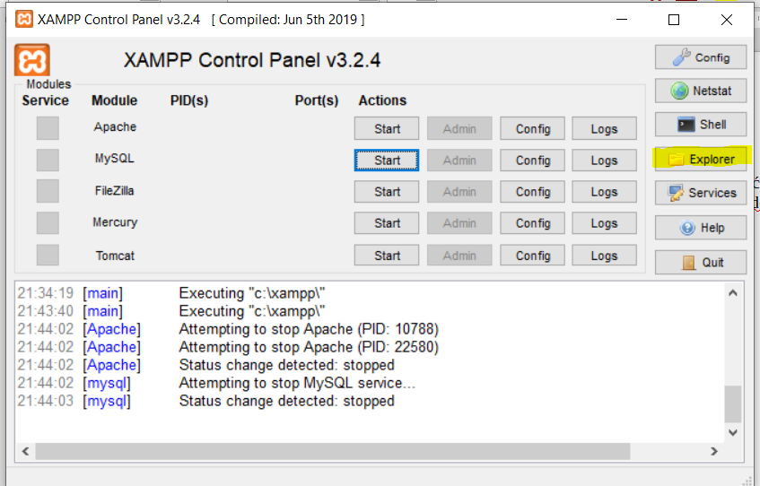

3. Startujemy Apcha i MySQL. 
4. Przy MySQL wybieramy przycisk "Admin". W tym momencie włączy się nam phpmyadmin.
5. Tworzymy nową bazę danych i nazywamy ją strona_spamerska (takie mamy połączenie w php).

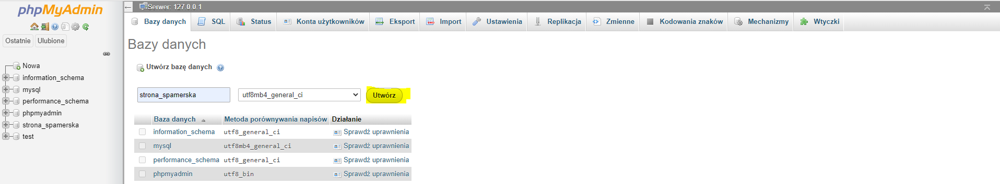

6. Tworzymy nową tabele i nazywamy ją user.

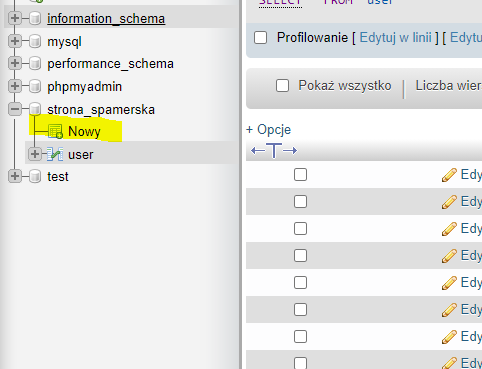

7. Dodajemy elementy w sposób przedstawiony na poniższym zrzucie ekranu:

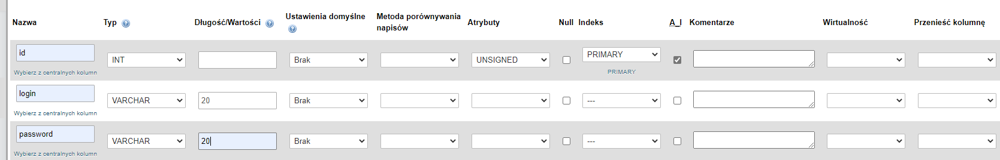

8. Zapisujemy i otwieramy projekt pod adresem: http://localhost/strona_spamerska/view/

**Ważne!**

- Aplikacja została stworzona na systemie operacyjnym Windows, ważne jest aby był on zaktualizowany. W przypadku korzystania z laptopa powinien byc on podłączony do prądu (chodzi o tryb oszczędzania baterii, który zablokuje harmonogram zadań)!

- Jeżeli xampp nie jest zainstalowany bezpośrednio na dysku c to wtedy należy zmienić ścieżkę dostępu w pliku send_mail.php w view.

```bash
$data = file_get_contents('/xampp/htdocs/strona_spamerska/view/'.$image);
```

## Jak korzystać z aplikacji

Należy się zarejestrować, lub zalogować. Wtedy przechodzimy na widok panelu administracyjnego, gdzie znajduje się formularz dotyczący wysyłania meila. Należy go wypełnić i wysłać.

## Jak działa aplikacja 

Po wypełnieniu formularza w folderze naszego projektu assets zapisują się załączone obrazki. Następnie zostaje przesłana komenda do cmd, która tworzy harmonogram zadań o wyznaczonej w formularzu godzinie. Jednocześnie w folderze bat tworzy się plik typu bat, który zostanie wywołany gdy nastąpi pora wywołania zadnia. Posiada on parametry meila. Wywołuje on  skrypt send_mail.php odpowiedzialny za przesłanie meila. 

## Jak skonfigurować smtp (na przykładzie gmail)

1. W xampp wybieramy Explorer.


2. Wybieramy php/php.ini
3. Wyszukujemy w treści [mail function]
4. Od [mail function] do [ODBC] skreślamy treść i wklajamy

```bash
SMTP = smtp.gmail.com
smtp_port = 587
sendmail_from = mail@gmail.com 
sendmail_path = "\"C:\xampp\sendmail\sendmail.exe\" -t" 
```

W sendmain_from podajemy swojego meila.

5. Wchodzimy tak samo jak w kroku 1 ale tym razem wybieramy sendmail/sendmail.ini
6. Usuwamy wszystko i wklejamy

```bash
[sendmail]
smtp_server = smtp.gmail.com 
smtp_port = 587 
error_logfile = error.log 
debug_logfile = debug.log 
auth_username = mail@gmail.com 
auth_password = haslo 
force_sender = testdevcorner@gmail.com
``` 

- W auth_username = mail@gmail.com podajemy swojego meila, a w auth_password = haslo  hasło do niego.

7. Ostatnim krokiem będzie nadanie praw na gmailu. Link do nadania uprawnień: 
https://support.google.com/accounts/answer/6010255?p=lsa_blocked&hl=pl&visit_id=637546291965916587-1508290013&rd=1#zippy=%2Cje%C5%9Bli-na-koncie-jest-w%C5%82%C4%85czony-dost%C4%99p-mniej-bezpiecznych-aplikacji

## Testy obciążeniowe

### Pierwszy test
```bash 
-n ilość żądań
-c ilość wysyłanych żądań naraz
dla c = 10, k = 10 
``` 

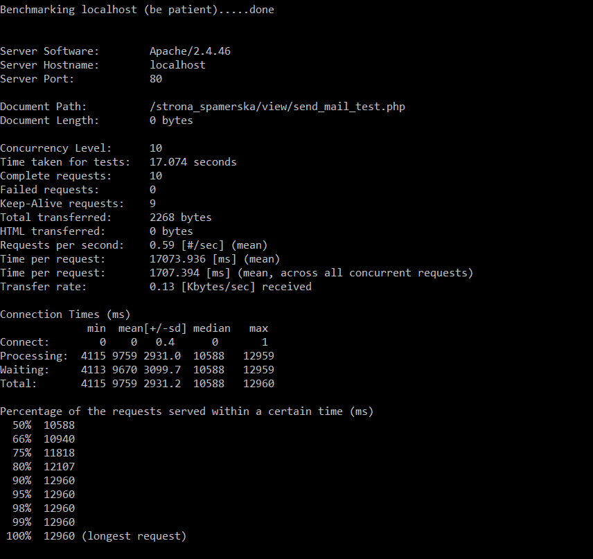
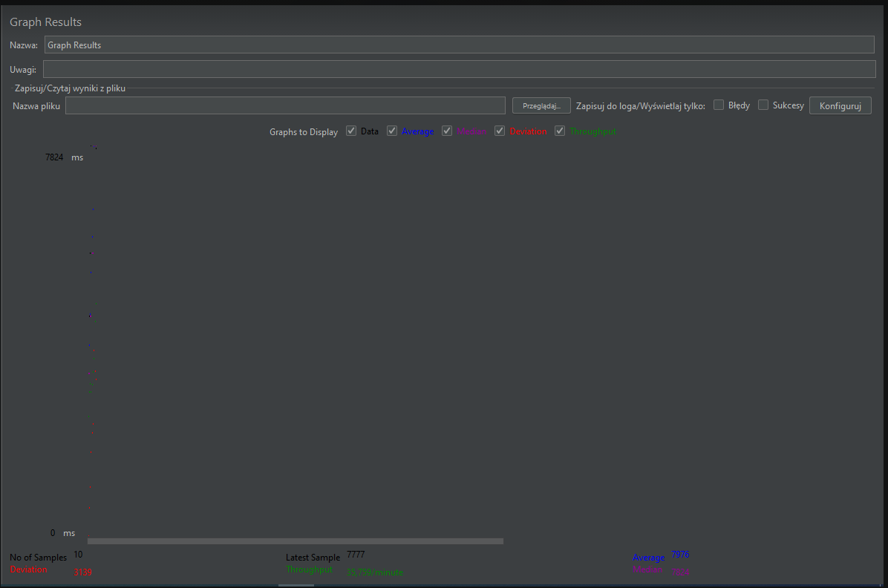

### Drugi test
```bash  
dla c = 10, k = 20
``` 

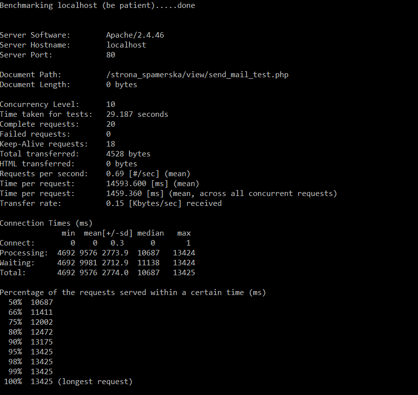

### Trzeci test
```bash  
dla c = 10, k = 30
``` 


### Czwarty test
```bash  
dla c = 10, k = 40
``` 

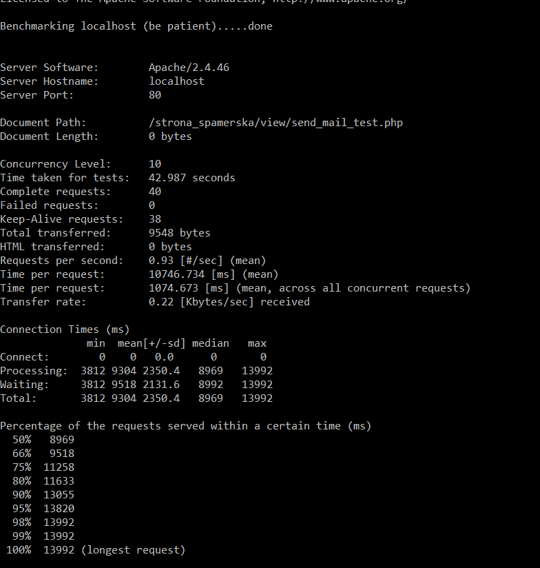

### Piąty test
```bash  
dla c = 10, k = 50
``` 

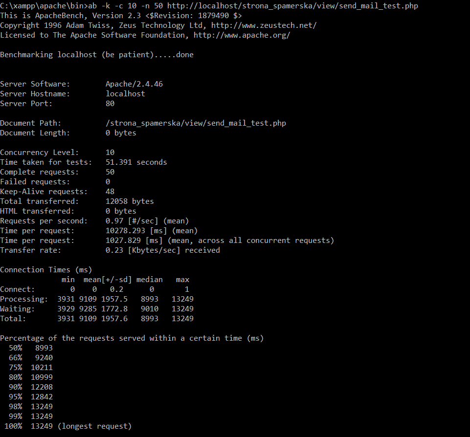
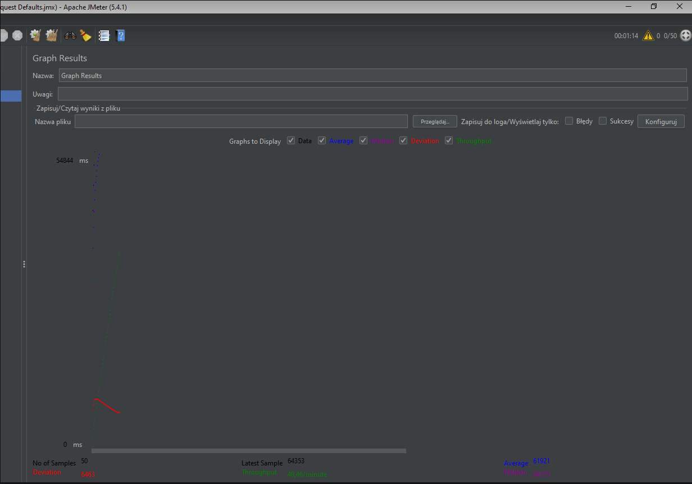

### Szósty test
```bash  
dla c = 10, k = 100
``` 

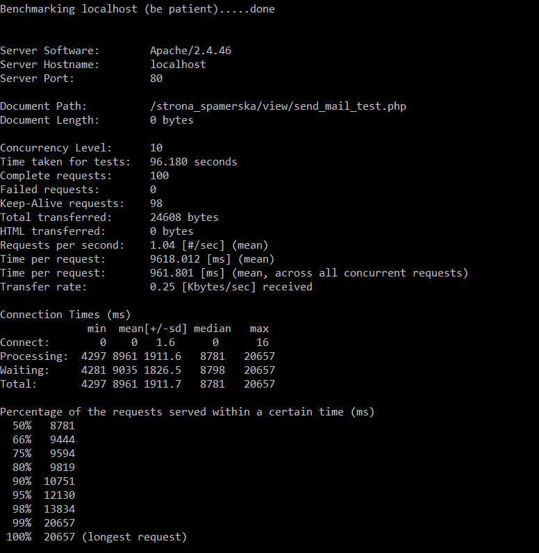
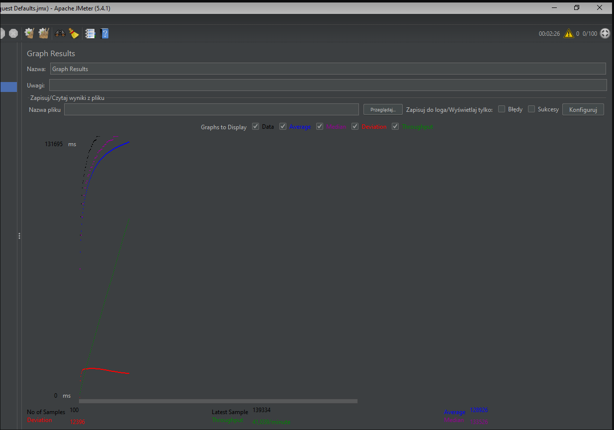

### Siódmy test
```bash  
dla c = 10, k = 1000
``` 

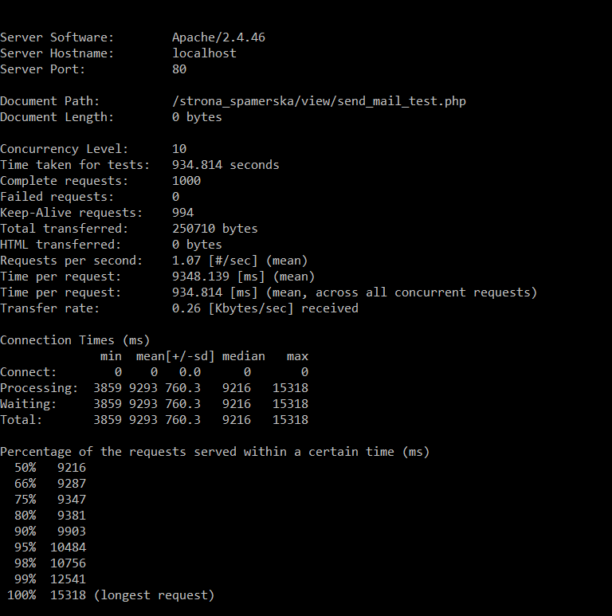
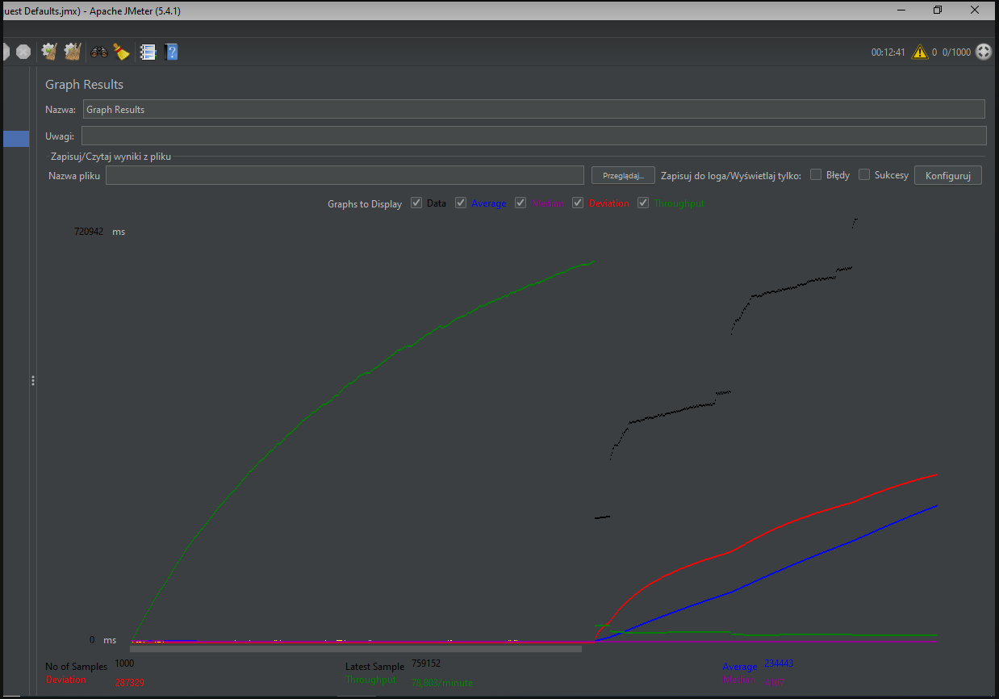